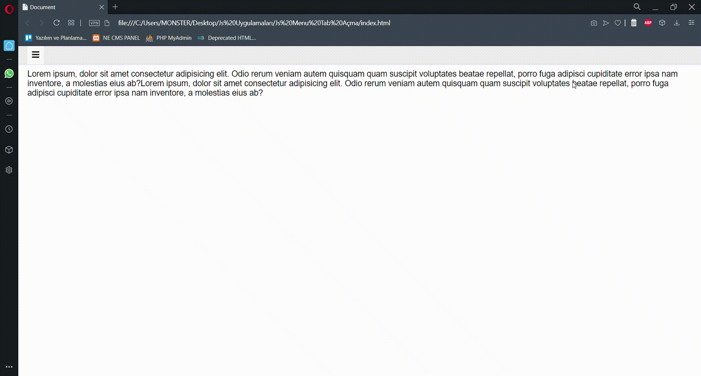

# JS-Side-Navigation-Menu
I've applied one of the examples in "Html Css and Js Web Design" book of Burak Tokak. This is a simple side navigation menu show project developed with Js. This project help me to practice on Javascript

